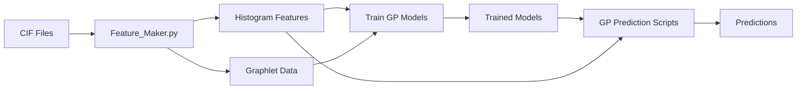

# GP-Tc: Superconductivity Prediction Pipeline

GP-Tc provides a complete end-to-end pipeline for predicting superconductivity properties of crystalline materials using Gaussian Process (GP) models with graphlet-based structural features and symmetry descriptors.

## Overview

The pipeline consists of four main stages:

1. **Feature Generation** (`main/`): Convert CIF files into ML-ready features
2. **Model Training** (`src/GP_Models/sc_train_gp-main/`): Train GP models on labeled data
3. **Prediction** (`src/GP_Models/`): Apply trained models to new materials
4. **Literature Search** (`src/precendent_search/`): Check whether candidate materials already appear in superconductivity literature

## Quick Start: Making Predictions

### Option 1: Command-Line Prediction (Single CIF)

The fastest way to predict superconductivity for a single material:

```bash
cd src

# Basic usage - outputs formatted results
python predict_single_cif.py /path/to/your/structure.cif

# JSON output for programmatic use
python predict_single_cif.py /path/to/your/structure.cif --json
```

The output includes:
- **Classification**: Probability of being a superconductor (0-1) with uncertainty
- **Regression**: Predicted critical temperature (Tc in K) with uncertainty

### Option 2: Python API (Programmatic Use)

For integration into your own scripts:

```python
from predict_single_cif import predict_single_cif

# Make predictions
result = predict_single_cif("/path/to/structure.cif")

print(f"Formula: {result['reduced_formula']}")
print(f"SC Probability: {result['classification_prob']:.3f}")
print(f"Predicted Tc: {result['regression_mean']:.1f} K")
```

---

## Advanced Usage

### Generate Features from CIF Files (Batch Processing)

For processing many CIF files in parallel:

```bash
cd main

# Set up paths
export MODE="CIF"
export CIF_DIR="/path/to/your/cifs"
export OUT_ROOT="../ICSD_Features"

# Run parallel feature generation
python Feature_Maker.py
```

**Requirements:**
- CIF filenames must contain `icsd_{id}.cif` (e.g., `compound_icsd_12345.cif`)
- Outputs: `Histogram_Features/` and `Graphlet_Data/` directories

See [`main/README.md`](main/README.md) for detailed usage.

### Train Your Own GP Models

```bash
cd src/GP_Models/sc_train_gp-main/scripts

# Train regression model (for Tc prediction)
python general_example_gp_regression.py \
    --save_data_dir "../../Trained Models/Regressor_4-2odr_all-sym" \
    --path_to_data_file "../../../data/regression_data_histogram&symmetry.pkl" \
    --list_of_hist_features_to_use 13 18 26 30 \
    --n_epochs 32

# Train classification model (superconductor vs. non-superconductor)
python general_example_gp_classification.py \
    --save_data_dir "../../Trained Models/Classifier_2odr_all-sym" \
    --path_to_data_file "../../../data/classification_data_3DSCnonsc_labeled.pkl" \
    --n_epochs 32 \
    --use_oversampling True
```

See [`src/GP_Models/sc_train_gp-main/README.md`](src/GP_Models/sc_train_gp-main/README.md) for all training options.

**Training hardware note:** The GP models were trained on an `NVIDIA RTX A5000 GPU`.

### Search the Literature

For checking whether candidate materials are already reported superconductors:

```bash
cd src/precendent_search

# Edison PRECEDENT search
python query_materials_with_edison.py --input your_materials.csv

# Combine Edison outputs into a CSV
python combine_predictions.py

# Gemini-based follow-up search over combined outputs
python pred.py --prompt related
```

See [`src/precendent_search/README.md`](src/precendent_search/README.md) for setup, API keys, prompts, and batch-processing details.

## Repository Structure

```
.
├── FEATURE_INDEX_MAPPING.md         # 📋 Feature index to name mapping
├── config/                          # Configuration files
│   ├── atomic_radii.json           # Atomic radii for graphlet construction
│   ├── Filtered_atomic_features.json  # Element features
│   ├── Space_group.xls             # Symmetry group mappings
│   ├── bin_centers_classification.pkl  # Histogram bins for classification
│   └── bin_centers_regression.pkl      # Histogram bins for regression
│
├── main/                            # Feature generation scripts
│   ├── Feature_Maker.py            # Main feature generation script
│   └── README.md                   # Feature generation documentation
│
├── src/                             # Source code
│   ├── predict_single_cif.py       # 🔮 Single CIF prediction (CLI)
│   ├── SplitGraphletSymmetryProcessor.py   # Core graphlet + symmetry processor
│   ├── PYGraphlets.py              # Graphlet construction library
│   ├── ParallelRunner.py           # Parallel processing utilities
│   ├── ProgressBar.py              # Progress tracking
│   │
│   ├── precendent_search/          # Literature search utilities
│   │   ├── query_materials_with_edison.py  # Edison PRECEDENT queries
│   │   ├── pred.py                 # Gemini follow-up prompts
│   │   ├── combine_predictions.py  # Merge batch outputs into CSV
│   │   └── README.md               # Literature search documentation
│   │
│   └── GP_Models/                  # GP model training & prediction
│       ├── GP_Regression_pred.py   # Regression prediction module
│       ├── GP_Classification_pred.py  # Classification prediction module
│       ├── Trained Models/         # Pre-trained model checkpoints
│       ├── sc_train_gp-main/       # Training framework
│       └── README.md               # GP workflow documentation
│
└── data/                            # Data directory
    ├── classification_data_3DSCnonsc_labeled.pkl  # Training data for classification
    ├── regression_data_histogram&symmetry.pkl     # Training data for regression
    ├── ICSD/
    │   └── CIFS/                   # Input CIF files
    └── Pickled_ICSD_Histograms/    # Pre-computed graphlets (optional)
```

## Dependencies

### Core Requirements
- Python 3.8+
- `numpy`
- `pandas`
- `pymatgen`
- `spglib`
- `torch`
- `gpytorch`
- `scikit-learn`

### Installation
```bash
pip install -r requirements.txt
```

### Optional API Clients
- `google-genai` for `src/precendent_search/pred.py`
- `edison-client` for `src/precendent_search/query_materials_with_edison.py`

## Key Features

### Graphlet-Based Structural Representation
- **1-site graphlets**: Atomic composition and local symmetry
- **2-site graphlets**: Bond lengths and pair features
- **3-site graphlets**: Triplet angles and geometric descriptors
- **Histogram features**: Fixed-bin 2D histograms using Earth Mover's Distance (EMD)

> 📋 See [FEATURE_INDEX_MAPPING.md](FEATURE_INDEX_MAPPING.md) for the complete list of 67 graphlet features and 11 symmetry features with their indices and descriptions.

### Symmetry Features
- Point group symmetry descriptors
- Site-specific symmetry operations
- Averaged symmetry vectors per structure

### Gaussian Process Models
- **Regression**: Predict continuous properties (e.g., critical temperature Tc)
- **Classification**: Binary classification (superconductor vs. non-superconductor)
- **Kernels**: Combined EMD kernel for histograms + RBF kernel for symmetry features
- **Scalability**: Variational inference with inducing points for large datasets

## Environment Variables

The pipeline supports configuration via environment variables:

| Variable | Description | Default |
|----------|-------------|---------|
| `MODE` | Feature generation mode: `"CIF"` or `"PICKLE"` | `"PICKLE"` |
| `CIF_DIR` | Directory containing input CIF files | `<project_root>/data/ICSD/CIFS` |
| `GRAPHLET_DIR` | Directory containing pre-computed graphlet pickles | `<project_root>/data/Pickled_ICSD_Histograms` |
| `OUT_ROOT` | Output directory for generated features | `<project_root>/ICSD_Features` |

## Authors

- **Aaditya Panigrahi** - Feature generation pipeline, graphlet processing
- **Yanjun Liu** - Graphlet symmetry processing
- **Natalie Maus** - GP model training framework
- **Krishnanand Mallayya** - PYGraphlets library
- **Omri Lesser** - Neural network regression models
- **Albert Gong** - Precedent search workflow
- **Anmol Kabra** - Precedent search workflow

## Citation

If you use this code in your research, please cite:

```bibtex
@article{lesser2025learning,
  title={Learning to predict superconductivity},
  author={Lesser, Omri and Liu, Yanjun and Maus, Natalie and Panigrahi, Aaditya and Mallayya, Krishnanand and Schoop, Leslie M. and Gardner, Jacob R. and Kim, Eun-Ah},
  journal={arXiv preprint arXiv:2510.07373},
  year={2025}
}
```

**Paper**: [arXiv:2510.07373](https://arxiv.org/abs/2510.07373)

## License

This project is licensed under the MIT License - see the [LICENSE](LICENSE) file for details.

## Support

For questions or issues:
- Check the individual README files in each directory
- Review the docstrings in the Python modules
- Open an issue on the repository

## Workflow Summary



1. **Input**: Crystallographic Information Files (CIF)
2. **Feature Extraction**: Graphlets + Symmetry → Histograms
3. **Training**: GP models learn from labeled data
4. **Prediction**: Apply models to new materials
5. **Output**: Predicted properties (Tc, superconductivity probability)
